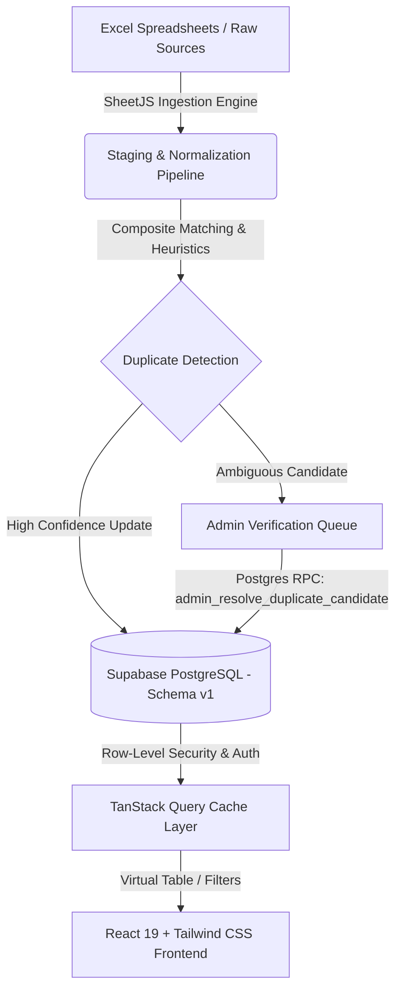

# RNSIT Alumni Intelligence Dashboard

[](https://vitejs.dev/)
[](https://react.dev/)
[](https://www.typescriptlang.org/)
[](https://tailwindcss.com/)
[](https://supabase.com/)
[](https://vitest.dev/)

A hardened, enterprise-grade Alumni Intelligence & Directory Management Platform engineered for **RNS Institute of Technology (RNSIT)**. The platform features an intelligent multi-sheet Excel ingestion pipeline, composite identity resolution, strict administrative role-based access control (RBAC), and lightning-fast discovery capabilities.

---

## 🏛️ System Architecture



### 1. Frontend & Presentation Layer
* **React 19 & Vite**: Ultra-fast build times, strict component boundaries, and reactive state management.
* **Tailwind CSS v4 & Custom Tokens**: Integrated dark/light theme engine, motion entrance animations, and full accessibility compliance (`prefers-reduced-motion`).
* **TanStack Table (v9) & TanStack Query (v5)**: High-performance client-side query caching, instantaneous filter updates, and paginated virtualized table rendering.
* **Component Primitives**: Custom visual wrappers including `Card`, `Drawer`, `Modal`, `FilterChip`, `Stepper`, and `CommandPalette` (`Ctrl/Cmd + K`).

### 2. Backend & Data Layer (Schema v1)
* **Single Source of Truth**: The live Supabase PostgreSQL database running **Schema v1** (`public.alumni`) serves as the authoritative persistence layer.
* **Row-Level Security (RLS)**: Enforced database-level policies ensuring that all reads and mutations require validated session signatures.
* **Governed Mutations**: Duplicate candidate resolutions strictly execute through database RPC functions (`admin_resolve_duplicate_candidate`), prohibiting unmonitored direct table mutations.

### 3. Multi-Sheet Excel Ingestion & Governance Engine
* **Intelligent Header Detection**: Algorithmic scoring matches arbitrary spreadsheet headers against canonical schema definitions across multiple sheet layouts (e.g. *High-Value Alumni*, *Top Employers*, *Global Spread*).
* **Composite Identity Matching**: Multi-factor scoring (Name + Batch Years + Academic Branch + Employer) accurately discriminates between distinct alumni sharing similar names versus canonical updates.
* **Defensive Export Security (CWE-1236)**: Implements formula injection sanitization on all CSV and Excel export utilities, neutralizing potentially malicious formula characters (`=`, `+`, `-`, `@`).

---

## 🛡️ Security Hardening & Administrative Governance

* **Strict Admin-Only RBAC**: The platform enforces an admin-only access model. User accounts must have `is_active = true` and `role = 'admin'` in `public.profiles`.
* **Out-of-Order Async Session Protection**: The authentication state machine isolates query caching upon sign-out or session rotation (`queryClient.clear()`), preventing stale privilege elevation.
* **Graceful Degradation & Fallbacks**: Defensive proxy patterns in the Supabase client provide explicit runtime diagnostics when environment keys are missing or malformed, preventing silent UI failures.

---

## 🎖️ Acknowledgments & Context

* **Event / Context**: RNSIT Alumni Dashboard Prototype
* **Collaboration / Institution**: [RNS Institute of Technology (RNSIT)](https://www.rnsit.ac.in/), Bengaluru, India
* **Role**: **Principal Architect & Co-developer**
* **Project Showcase**: This repository serves as an independent technical showcase of individual architectural design, robust data pipeline engineering, security hardening, and modern frontend execution.

---

## 🚀 Getting Started

### Prerequisites
* **Node.js**: `v18.0.0` or higher (tested on `v24.x`)
* **npm**: `v9.0.0` or higher

### 1. Clone & Navigate
```bash
git clone https://github.com/Dannyo6/rnsit-alumni-dashboard.git
cd rnsit-alumni-dashboard
```

### 2. Configure Environment Variables
Copy the sample environment configuration in the `frontend` directory:
```bash
cd frontend
cp .env.example .env
```

Populate `.env` with your Supabase project credentials:
```env
VITE_SUPABASE_URL=https://your-project-ref.supabase.co
VITE_SUPABASE_PUBLISHABLE_KEY=sb_publishable_your_key_here
```

### 3. Install Dependencies
```bash
npm install
```

### 4. Run Development Server
```bash
npm run dev
```
The application will be accessible at `http://localhost:5173`.

---

## 🧪 Testing & Verification

The repository includes a comprehensive test suite with 214 test assertions covering authentication state transitions, schema compatibility, duplicate resolution governance, search parser mechanics, and export safety.

### Run Vitest Suite
```bash
npm run test
```
Expected output:
```text
Test Files  13 passed (13)
     Tests  214 passed (214)
```

### Run Production Build
```bash
npm run build
```
Executes TypeScript typecheck (`tsc -b`) and Vite production bundle generation.

---

## 📂 Repository Structure

```text
rnsit-alumni-dashboard/
├── analysis/              # Data inspection & offline Excel parsing scripts
├── docs/                  # Architectural documentation and schema history
├── frontend/              # Core React 19 + Vite web application
│   ├── src/
│   │   ├── components/    # Reusable UI primitives and layout structures
│   │   ├── contexts/      # Auth state machine & theme providers
│   │   ├── pages/         # Dashboard, Directory, Admin, Data Quality, Import
│   │   ├── services/      # Supabase data access & mutation services
│   │   ├── tests/         # Vitest unit & integration test suite (214 tests)
│   │   └── utils/         # Ingestion, formatting, and export safety utilities
│   ├── package.json
│   └── vite.config.ts
├── puppeteer_test/        # Headless E2E browser and performance test suites
├── supabase/              # PostgreSQL schema migrations (Schema v1)
├── .gitignore
├── HANDOFF.md             # Integration history and semantic merge details
└── README.md
```

---

## 📄 License

This prototype and codebase are developed for administrative and academic purposes for RNSIT. All rights reserved.
